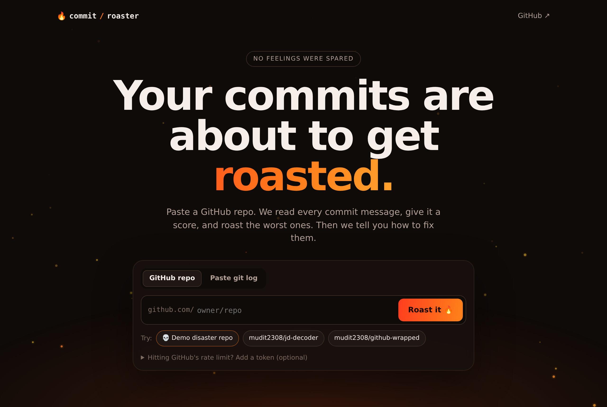
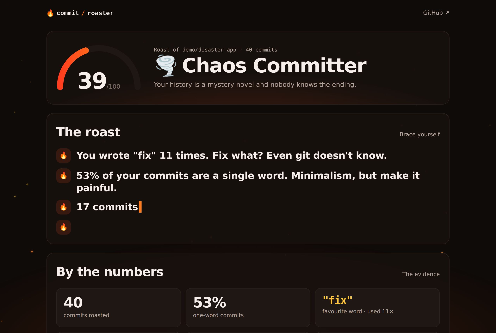
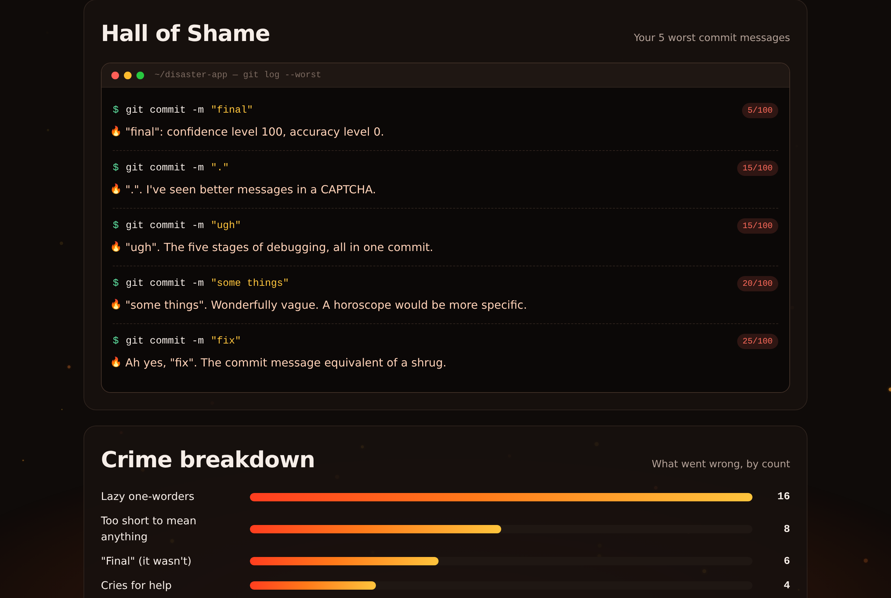

# Commit Roaster 🔥

**Your commits are about to get roasted.**

Paste a GitHub repo and Commit Roaster reads every commit message, gives the repo a score out of 100, roasts the worst offenders, and then shows you how to write better commits.

**Live demo:** https://mudit2308.github.io/commit-roaster/



## Features

- **A score and a title**: from "Commit Poet 🧑‍🎨" down to "Certified Disaster 💀"
- **The roast**: headline burns based on your history ("You wrote "fix" 11 times. Fix what?"), typed out live
- **Hall of Shame**: your 5 worst commit messages in a terminal, each with its own roast, and never the same joke twice
- **By the numbers**: one-word commits, favourite word, commits after midnight, weekend commits
- **Crime breakdown**: lazy one-worders, keyboard smashes, "final final v2", ALL CAPS, cries for help…
- **Hall of Fame**: the commits that were actually good
- **How to fix it**: practical tips with before/after examples, including Conventional Commits
- **Shareable roast card**: download a 1080×1350 image for LinkedIn or Instagram
- **Private repos**: paste the output of `git log` instead of a link
- **Demo mode**: try it instantly with a gloriously messy sample repo




## How it works

It's a static site with no backend. The browser fetches up to 300 recent commits from the public GitHub API, and a rule-based engine scores each message:

| Check | Example | Penalty |
| --- | --- | --- |
| Keyboard smash | `asdf`, `.`, `qwerty` | −85 |
| Lazy one-worder | `fix`, `update`, `wip` | −75 |
| "Final" | `final final v2` | −50 |
| Too short | `css` | −45 |
| Cry for help | `pls work now` | −40 |
| Shouting | `FIXED THE BUG` | −35 |
| Vague | `update stuff` | −35 |
| Subject over 72 characters | | −15 |

Messages with no issues score 80–100; imperative or Conventional Commit messages ("Add login page…", "feat: add dark mode") score 100. The repo's score is the average. Roast lines are picked deterministically, so the same repo always gets the same roast.

```
index.html        page structure
style.css         design and animations
src/roast.js      scoring engine, headlines, hall of shame (pure functions)
src/lines.js      roast lines, tiers and tips
src/github.js     GitHub API client and repo-link parsing
src/demo.js       sample repo for demo mode
src/embers.js     floating embers background
src/app.js        UI, animations and sharing
test/             unit tests
```

## Run locally

```sh
npm start     # serves the folder at http://localhost:3000
npm test      # runs the unit tests (Node 18+)
```

## Deploy

GitHub Pages: **Settings → Pages → Deploy from a branch → `main` / root**.

---

All roasts are about commit messages, not people. 🫶

## License

MIT
